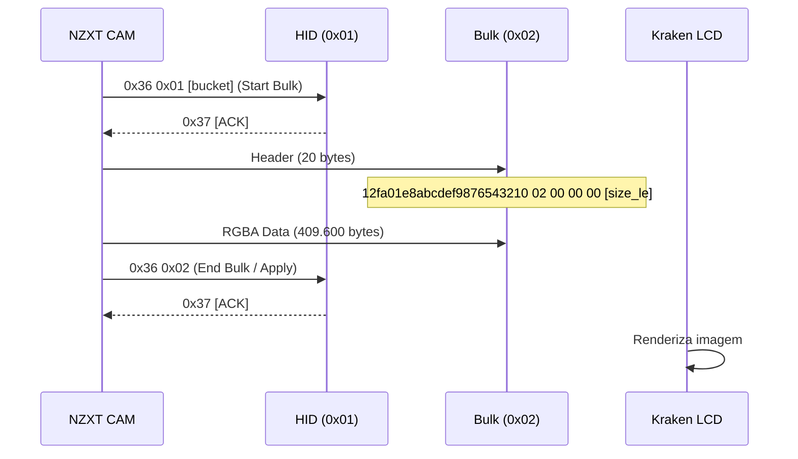

# Protocolo USB NZXT CAM para LCD Kraken

Documentação completa baseada em análise Wireshark da comunicação CAM → Kraken LCD.

## Resumo do Protocolo

| Campo | Valor |
|-------|-------|
| Magic Header | `12fa01e8abcdef9876543210` |
| Asset Type | `0x02` (imagem estática) |
| Tamanho | 409.600 bytes (320×320×4) |
| Formato | **RGBA** |
| Alpha | Sempre 0xFF (opaco) |
| Intervalo | ~1 segundo entre frames |

## Fluxo de Comunicação



## Estrutura do Header Bulk (20 bytes)

| Offset | Bytes | Descrição |
|--------|-------|-----------|
| 0-11 | `12fa01e8abcdef9876543210` | Magic header |
| 12 | `02` | Asset type (imagem estática) |
| 13-15 | `00 00 00` | Padding |
| 16-19 | `00 40 06 00` | Tamanho LE (409.600) |

## Comandos HID Relacionados

| Comando | Bytes | Descrição |
|---------|-------|-----------|
| Bulk Start | `0x36 0x01 [bucket]` | Inicia transferência |
| Bulk End | `0x36 0x02` | Finaliza e aplica |
| Response | `0x37 ...` | ACK do dispositivo |

## Implementação Rust

```rust
// bulk.rs - já implementado corretamente
pub fn upload_raw_rgba(&self, rgba_data: &[u8]) -> Result<()> {
    // 1. Monta header (20 bytes)
    let header = [
        0x12, 0xFA, 0x01, 0xE8, 0xAB, 0xCD, 0xEF, 0x98,
        0x76, 0x54, 0x32, 0x10, 0x02, 0x00, 0x00, 0x00,
        // size as little-endian u32
    ];
    
    // 2. Envia header via bulk
    self.write_bulk(&header)?;
    
    // 3. Envia dados RGBA via bulk
    self.write_bulk(rgba_data)?;
    
    Ok(())
}
```


